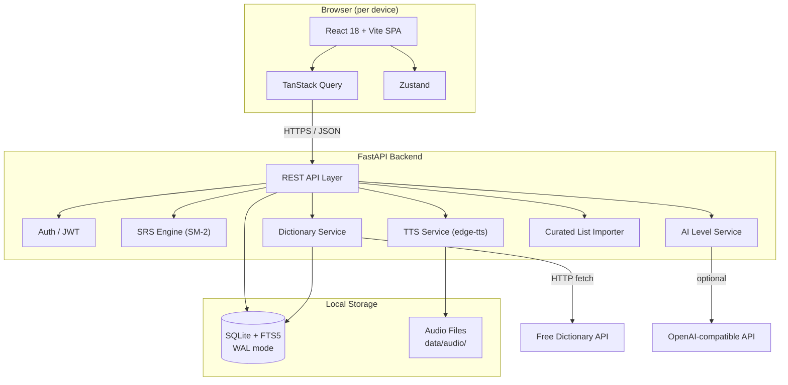
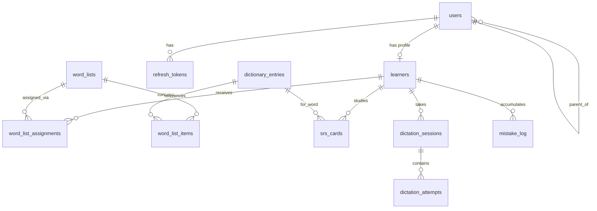

# myvocabulary — Phase 1 Technical Specification

**Version:** 1.2  
**Date:** 2026-08-04  
**Status:** Shipped on `main` (historical). For loop / readiness / Level-up rules see [phase-2-spec.md](./phase-2-spec.md).  
**Repository:** `hkdad/myvocabulary`

---

## 1. Executive Summary

### 1.1 Goals

**myvocabulary** is a family vocabulary learning and dictionary application for kids, managed by a parent account. Phase 1 delivers a self-hosted, English-only web app with:

- Per-child learner accounts on separate devices with long-lived sessions
- English dictionary with search, definitions, and TTS
- **Curated vocabulary lists** from public CEFR-aligned sources, assignable per child
- Parent-managed custom word lists; assignments adjustable over time
- Flashcards with SM-2 spaced repetition (SRS)
- Age-appropriate dictation modes
- **AI-assisted level assessment** with parent approval
- **Level-up challenges** to keep learning engaging
- Parent dashboard showing progress for both children
- **Docker deployment** via `start.sh` one-command startup

### 1.2 Family Profiles (Seed Data)

| Profile | Age | English Level | UI Mode | Device |
|---------|-----|---------------|---------|--------|
| Teen demo (Mia) | 13 | B1 | `teen` | Own device |
| Kid demo (Leo) | 9 | A2 | `kid` | Own device |
| Younger demo (Max) | 5 | PRE-A1 | `kid` | Own device |
| Parent | — | — | — | Parent device for dashboard |

### 1.3 Success Criteria

| Criterion | Target |
|-----------|--------|
| Parent can create/manage two learner profiles | ✓ |
| Each child logs in independently and stays signed in | 30-day refresh token |
| Dictionary lookup + TTS works offline after first fetch | Local audio cache |
| Parent assigns word lists per child | Per-learner assignment |
| Curated CEFR lists available per level | Catalog imported at setup |
| AI suggests level adjustments | Parent approves changes |
| Level-up challenges unlock next level | ≥ 80% pass rate |
| SRS reviews run per child with isolated progress | SM-2 in Python |
| Dictation adapts to `ui_mode` (kid vs teen) | Distinct UX rules |
| Parent sees aggregate + per-child stats | Dashboard |

### 1.4 Phase 1 Scope

| In Scope | Out of Scope |
|----------|--------------|
| Parent + learner auth (JWT or httpOnly cookies) | Chinese / bilingual support |
| 2 learner profiles (configurable count ≤ 5) | Mobile native apps |
| English dictionary (Free Dictionary API) | Social features, public leaderboards |
| Curated CEFR word list catalog + custom lists | Anki import |
| Word list CRUD + assignment (adjustable over time) | Speech-to-text dictation |
| Flashcards + SM-2 SRS | Multi-tenant SaaS hosting |
| Dictation (typed + multiple-choice for kid mode) | Email notifications |
| AI-assisted level assessment (optional API key) | PostgreSQL migration |
| Level-up challenges + badges | |
| TTS via edge-tts | |
| Parent dashboard | |
| SQLite + FTS5 | |
| Docker deployment + `start.sh` | |

---

## 2. System Architecture

### 2.1 High-Level Architecture



### 2.2 Component Boundaries

| Layer | Responsibility | Technology |
|-------|----------------|------------|
| **Presentation** | Routes, pages, role-based UI, `ui_mode` theming | React, Tailwind, shadcn/ui |
| **Client State** | Auth tokens, active learner context, UI prefs | Zustand + localStorage |
| **Server State** | API data fetching, cache invalidation | TanStack Query |
| **API** | REST endpoints, validation, auth guards | FastAPI, Pydantic v2 |
| **Domain** | SRS, dictation scoring, list assignment, AI level assessment, challenges | Python services |
| **Persistence** | ORM models, migrations, FTS5 triggers | SQLAlchemy 2.0, Alembic |
| **Media** | TTS generation, audio caching | edge-tts, pydub, ffmpeg |

### 2.3 Deployment Model

**Production:** Docker container via `docker-compose`, started with `./start.sh`.

**Development:** Native `make dev` (backend + Vite) without Docker.

Single machine (family NAS, home server, or VPS):

- FastAPI serves API at `/api/v1/*` and static React build
- SQLite file at `data/myvocabulary.db` (Docker volume mount)
- Audio at `data/audio/`
- Port `8080` exposed by default

---

## 3. Repository Structure

```
myvocabulary/
├── README.md
├── start.sh                        # One-command Docker startup
├── docker-compose.yml
├── Dockerfile
├── .dockerignore
├── Makefile
├── backend/
│   ├── pyproject.toml
│   ├── alembic.ini
│   ├── alembic/
│   ├── app/
│   │   ├── main.py
│   │   ├── config.py
│   │   ├── database.py
│   │   ├── dependencies.py
│   │   ├── models/
│   │   ├── schemas/
│   │   ├── api/v1/
│   │   ├── services/
│   │   └── core/
│   ├── scripts/
│   │   ├── seed.py
│   │   ├── import_curated_lists.py
│   │   └── backup-db.sh
│   └── tests/
├── frontend/
│   ├── package.json
│   ├── vite.config.ts
│   └── src/
│       ├── api/
│       ├── stores/
│       ├── hooks/
│       ├── components/
│       ├── pages/
│       ├── routes/
│       └── types/
├── data/                   # gitignored
│   ├── myvocabulary.db
│   └── audio/
└── docs/
    ├── phase-1-spec.md
    └── project-plan.md
```

---

## 4. SQLite Schema

### 4.1 Conventions

- Integer primary keys (`id`)
- Timestamps: `created_at`, `updated_at` (UTC, ISO 8601)
- WAL mode: `PRAGMA journal_mode=WAL;`
- Foreign keys: `PRAGMA foreign_keys=ON;`

### 4.2 Entity Relationship Diagram



### 4.3 Table Definitions

#### `users`

| Column | Type | Constraints | Notes |
|--------|------|-------------|-------|
| `id` | INTEGER | PK AUTOINCREMENT | |
| `username` | TEXT | UNIQUE NOT NULL | Login identifier |
| `email` | TEXT | UNIQUE | Optional for parent |
| `password_hash` | TEXT | NOT NULL | bcrypt |
| `role` | TEXT | NOT NULL CHECK | `'parent'` \| `'learner'` |
| `parent_id` | INTEGER | FK → users(id) | NULL for parent; set for learners |
| `is_active` | BOOLEAN | DEFAULT 1 | |
| `created_at` | DATETIME | NOT NULL | |
| `updated_at` | DATETIME | NOT NULL | |

#### `learners`

| Column | Type | Constraints | Notes |
|--------|------|-------------|-------|
| `id` | INTEGER | PK AUTOINCREMENT | |
| `user_id` | INTEGER | UNIQUE FK → users(id) ON DELETE CASCADE | 1:1 with user |
| `display_name` | TEXT | NOT NULL | e.g. "Mia", "Leo" |
| `age` | INTEGER | NOT NULL | |
| `english_level` | TEXT | NOT NULL CHECK | `'A1'`\|`'A2'`\|`'B1'`\|`'B2'` |
| `ui_mode` | TEXT | NOT NULL CHECK | `'kid'` \| `'teen'` |
| `avatar_url` | TEXT | | Optional |
| `daily_review_goal` | INTEGER | DEFAULT 20 | Cards per day target |
| `created_at` | DATETIME | NOT NULL | |
| `updated_at` | DATETIME | NOT NULL | |

#### `refresh_tokens`

| Column | Type | Constraints | Notes |
|--------|------|-------------|-------|
| `id` | INTEGER | PK AUTOINCREMENT | |
| `user_id` | INTEGER | FK → users(id) ON DELETE CASCADE | |
| `token_hash` | TEXT | UNIQUE NOT NULL | SHA-256 of token |
| `device_label` | TEXT | | e.g. "iPad", "Laptop" |
| `expires_at` | DATETIME | NOT NULL | 30 days for learners |
| `revoked_at` | DATETIME | | |
| `created_at` | DATETIME | NOT NULL | |

#### `dictionary_entries`

| Column | Type | Constraints | Notes |
|--------|------|-------------|-------|
| `id` | INTEGER | PK AUTOINCREMENT | |
| `word` | TEXT | UNIQUE NOT NULL | Lowercase canonical form |
| `phonetic` | TEXT | | IPA |
| `part_of_speech` | TEXT | | Primary POS |
| `definition` | TEXT | NOT NULL | Primary definition |
| `example_sentence` | TEXT | | |
| `synonyms` | TEXT | | JSON array string |
| `source` | TEXT | NOT NULL | `'freedictionary'` \| `'manual'` |
| `source_url` | TEXT | | |
| `audio_path` | TEXT | | Relative path under `data/audio/` |
| `fetched_at` | DATETIME | | Last API fetch |
| `created_at` | DATETIME | NOT NULL | |
| `updated_at` | DATETIME | NOT NULL | |

#### `dictionary_entries_fts` (FTS5 Virtual Table)

```sql
CREATE VIRTUAL TABLE dictionary_entries_fts USING fts5(
    word,
    definition,
    example_sentence,
    content='dictionary_entries',
    content_rowid='id',
    tokenize='porter unicode61'
);
```

Sync triggers on INSERT, UPDATE, DELETE keep FTS5 in sync with `dictionary_entries`.

#### `word_lists`

| Column | Type | Constraints | Notes |
|--------|------|-------------|-------|
| `id` | INTEGER | PK AUTOINCREMENT | |
| `parent_id` | INTEGER | FK → users(id) ON DELETE CASCADE | Owner |
| `name` | TEXT | NOT NULL | |
| `description` | TEXT | | |
| `level_tag` | TEXT | | CEFR: A1, A2, B1, B2 |
| `source` | TEXT | NOT NULL DEFAULT 'custom' | `'curated'` \| `'custom'` |
| `source_url` | TEXT | | Original list URL (curated only) |
| `is_active` | BOOLEAN | DEFAULT 1 | |
| `created_at` | DATETIME | NOT NULL | |
| `updated_at` | DATETIME | NOT NULL | |

#### `word_list_items`

| Column | Type | Constraints | Notes |
|--------|------|-------------|-------|
| `id` | INTEGER | PK AUTOINCREMENT | |
| `word_list_id` | INTEGER | FK → word_lists(id) ON DELETE CASCADE | |
| `dictionary_entry_id` | INTEGER | FK → dictionary_entries(id) | |
| `sort_order` | INTEGER | DEFAULT 0 | |
| `notes` | TEXT | | Parent notes |
| `created_at` | DATETIME | NOT NULL | |

**Unique:** `(word_list_id, dictionary_entry_id)`

#### `word_list_assignments`

| Column | Type | Constraints | Notes |
|--------|------|-------------|-------|
| `id` | INTEGER | PK AUTOINCREMENT | |
| `word_list_id` | INTEGER | FK → word_lists(id) ON DELETE CASCADE | |
| `learner_id` | INTEGER | FK → learners(id) ON DELETE CASCADE | |
| `assigned_at` | DATETIME | NOT NULL | |
| `due_date` | DATE | | Optional deadline |
| `is_active` | BOOLEAN | DEFAULT 1 | |
| `created_at` | DATETIME | NOT NULL | |

**Unique:** `(word_list_id, learner_id)`

#### `srs_cards`

| Column | Type | Constraints | Notes |
|--------|------|-------------|-------|
| `id` | INTEGER | PK AUTOINCREMENT | |
| `learner_id` | INTEGER | FK → learners(id) ON DELETE CASCADE | |
| `dictionary_entry_id` | INTEGER | FK → dictionary_entries(id) | |
| `word_list_id` | INTEGER | FK → word_lists(id) NULL | Source list |
| `ease_factor` | REAL | DEFAULT 2.5 | SM-2 EF |
| `interval_days` | INTEGER | DEFAULT 0 | |
| `repetitions` | INTEGER | DEFAULT 0 | |
| `due_at` | DATETIME | NOT NULL | Next review time |
| `last_reviewed_at` | DATETIME | | |
| `last_quality` | INTEGER | | 0–5 |
| `state` | TEXT | DEFAULT 'new' | `'new'`\|`'learning'`\|`'review'`\|`'relearning'` |
| `created_at` | DATETIME | NOT NULL | |
| `updated_at` | DATETIME | NOT NULL | |

**Unique:** `(learner_id, dictionary_entry_id)`

#### `srs_review_log`

| Column | Type | Constraints | Notes |
|--------|------|-------------|-------|
| `id` | INTEGER | PK AUTOINCREMENT | |
| `srs_card_id` | INTEGER | FK → srs_cards(id) ON DELETE CASCADE | |
| `learner_id` | INTEGER | FK → learners(id) | |
| `quality` | INTEGER | NOT NULL | 0–5 |
| `ease_factor_before` | REAL | | |
| `ease_factor_after` | REAL | | |
| `interval_before` | INTEGER | | |
| `interval_after` | INTEGER | | |
| `reviewed_at` | DATETIME | NOT NULL | |

#### `dictation_sessions`

| Column | Type | Constraints | Notes |
|--------|------|-------------|-------|
| `id` | INTEGER | PK AUTOINCREMENT | |
| `learner_id` | INTEGER | FK → learners(id) ON DELETE CASCADE | |
| `word_list_id` | INTEGER | FK → word_lists(id) NULL | |
| `mode` | TEXT | NOT NULL CHECK | `'typed'` \| `'choice'` |
| `ui_mode_snapshot` | TEXT | NOT NULL | kid/teen at session start |
| `total_words` | INTEGER | NOT NULL | |
| `correct_count` | INTEGER | DEFAULT 0 | |
| `started_at` | DATETIME | NOT NULL | |
| `completed_at` | DATETIME | | |
| `created_at` | DATETIME | NOT NULL | |

#### `dictation_attempts`

| Column | Type | Constraints | Notes |
|--------|------|-------------|-------|
| `id` | INTEGER | PK AUTOINCREMENT | |
| `session_id` | INTEGER | FK → dictation_sessions(id) ON DELETE CASCADE | |
| `dictionary_entry_id` | INTEGER | FK → dictionary_entries(id) | |
| `prompt_audio_path` | TEXT | | |
| `expected_word` | TEXT | NOT NULL | |
| `submitted_answer` | TEXT | | |
| `is_correct` | BOOLEAN | NOT NULL | |
| `hint_used` | BOOLEAN | DEFAULT 0 | Kid mode only |
| `attempt_number` | INTEGER | DEFAULT 1 | |
| `created_at` | DATETIME | NOT NULL | |

#### `mistake_log`

| Column | Type | Constraints | Notes |
|--------|------|-------------|-------|
| `id` | INTEGER | PK AUTOINCREMENT | |
| `learner_id` | INTEGER | FK → learners(id) ON DELETE CASCADE | |
| `dictionary_entry_id` | INTEGER | FK → dictionary_entries(id) | |
| `context` | TEXT | NOT NULL CHECK | `'dictation'`\|`'review'`\|`'flashcard'` |
| `wrong_answer` | TEXT | | |
| `occurred_at` | DATETIME | NOT NULL | |
| `resolved_at` | DATETIME | | Cleared after 3 correct |

#### `level_challenges`

| Column | Type | Constraints | Notes |
|--------|------|-------------|-------|
| `id` | INTEGER | PK AUTOINCREMENT | |
| `learner_id` | INTEGER | FK → learners(id) ON DELETE CASCADE | |
| `challenge_type` | TEXT | NOT NULL | `'level_up'`\|`'streak'`\|`'mistake_mastery'`\|`'speed_dictation'` |
| `target_level` | TEXT | | For level_up challenges |
| `status` | TEXT | DEFAULT 'pending' | `'pending'`\|`'in_progress'`\|`'passed'`\|`'failed'` |
| `score` | REAL | | Percentage correct |
| `pass_threshold` | REAL | DEFAULT 0.8 | 80% to pass level_up |
| `started_at` | DATETIME | | |
| `completed_at` | DATETIME | | |
| `created_at` | DATETIME | NOT NULL | |

#### `level_assessments`

| Column | Type | Constraints | Notes |
|--------|------|-------------|-------|
| `id` | INTEGER | PK AUTOINCREMENT | |
| `learner_id` | INTEGER | FK → learners(id) ON DELETE CASCADE | |
| `current_level` | TEXT | NOT NULL | Level at time of assessment |
| `suggested_level` | TEXT | NOT NULL | AI or rule-based suggestion |
| `reason` | TEXT | | Human-readable explanation |
| `source` | TEXT | NOT NULL | `'ai'` \| `'rule_based'` |
| `status` | TEXT | DEFAULT 'pending' | `'pending'`\|`'accepted'`\|`'dismissed'` |
| `assessed_at` | DATETIME | NOT NULL | |
| `resolved_at` | DATETIME | | When parent acted |

#### `learner_badges`

| Column | Type | Constraints | Notes |
|--------|------|-------------|-------|
| `id` | INTEGER | PK AUTOINCREMENT | |
| `learner_id` | INTEGER | FK → learners(id) ON DELETE CASCADE | |
| `badge_type` | TEXT | NOT NULL | `'level_up'`\|`'streak_7'`\|`'mistake_master'` |
| `earned_at` | DATETIME | NOT NULL | |

---

## 5. API Specification

**Base URL:** `/api/v1`  
**Content-Type:** `application/json`  
**Auth Header:** `Authorization: Bearer <access_token>` (or httpOnly cookie session)

### 5.1 Auth (`/auth`)

| Method | Path | Auth | Description |
|--------|------|------|-------------|
| POST | `/auth/login` | None | Login |
| POST | `/auth/refresh` | None | Refresh access token |
| POST | `/auth/logout` | Bearer | Revoke refresh token |
| GET | `/auth/me` | Bearer | Current user + learner profile |

### 5.2 Learners (`/learners`) — Parent only

| Method | Path | Description |
|--------|------|-------------|
| GET | `/learners` | List parent's learners |
| POST | `/learners` | Create learner account |
| GET | `/learners/{id}` | Get learner detail |
| PATCH | `/learners/{id}` | Update profile (set `is_active: false` to deactivate) |
| DELETE | `/learners/{id}` | Permanently delete learner account and all progress |
| POST | `/learners/{id}/reset-password` | Reset learner password |
| POST | `/learners/{id}/revoke-sessions` | Revoke all sessions |

### 5.3 Dictionary (`/dictionary`)

| Method | Path | Auth | Description |
|--------|------|------|-------------|
| GET | `/dictionary/search` | Any | FTS5 search |
| GET | `/dictionary/words/{word}` | Any | Lookup by word |
| POST | `/dictionary/words` | Parent | Manual word entry |
| GET | `/dictionary/words/{word}/audio` | Any | Stream/generate TTS |

### 5.4 Word Lists (`/word-lists`)

| Method | Path | Role | Description |
|--------|------|------|-------------|
| GET | `/word-lists` | Parent | List all lists |
| POST | `/word-lists` | Parent | Create list |
| GET | `/word-lists/{id}` | Parent/Learner* | Get list with items |
| PATCH | `/word-lists/{id}` | Parent | Update metadata |
| DELETE | `/word-lists/{id}` | Parent | Delete list |
| POST | `/word-lists/{id}/items` | Parent | Add word to list |
| DELETE | `/word-lists/{id}/items/{item_id}` | Parent | Remove item |
| POST | `/word-lists/{id}/assign` | Parent | Assign to learner(s) |
| DELETE | `/word-lists/{id}/assign/{learner_id}` | Parent | Unassign |
| GET | `/word-lists/assigned` | Learner | Lists assigned to me |
| GET | `/word-lists/catalog` | Parent | Browse curated lists by level |

### 5.5 SRS Reviews (`/reviews`)

| Method | Path | Role | Description |
|--------|------|------|-------------|
| GET | `/reviews/due` | Learner | Due cards for session |
| GET | `/reviews/stats` | Learner | Today's progress |
| POST | `/reviews/{card_id}/answer` | Learner | Submit quality rating |
| POST | `/reviews/initialize` | Learner | Create SRS cards from assigned list |
| GET | `/reviews/mistakes` | Learner | Words with recent mistakes |

### 5.6 Dictation (`/dictation`)

| Method | Path | Role | Description |
|--------|------|------|-------------|
| POST | `/dictation/sessions` | Learner | Start session |
| GET | `/dictation/sessions/{id}` | Learner | Get session state |
| GET | `/dictation/sessions/{id}/next` | Learner | Next word prompt |
| POST | `/dictation/sessions/{id}/answer` | Learner | Submit answer |
| POST | `/dictation/sessions/{id}/complete` | Learner | Finish session |
| GET | `/dictation/history` | Learner/Parent* | Past sessions |

### 5.7 Dashboard (`/dashboard`) — Parent only

| Method | Path | Description |
|--------|------|-------------|
| GET | `/dashboard/overview` | Both kids summary |
| GET | `/dashboard/learners/{id}` | Single learner detail |
| GET | `/dashboard/learners/{id}/activity` | Recent activity feed |

### 5.8 Level Assessment (`/level-assessment`) — Parent

| Method | Path | Description |
|--------|------|-------------|
| GET | `/level-assessment/learners/{id}` | Latest suggestion for child |
| POST | `/level-assessment/{id}/accept` | Accept level change |
| POST | `/level-assessment/{id}/dismiss` | Dismiss suggestion |
| POST | `/level-assessment/learners/{id}/run` | Trigger new assessment |

### 5.9 Challenges (`/challenges`) — Learner

| Method | Path | Description |
|--------|------|-------------|
| GET | `/challenges/available` | Challenges learner can attempt |
| POST | `/challenges/start` | Start a challenge session |
| POST | `/challenges/{id}/submit` | Submit challenge answers |
| GET | `/challenges/history` | Past challenge results |
| GET | `/challenges/badges` | Earned badges |

---

## 6. Authentication & Authorization

### 6.1 Token Strategy

| Token | Lifetime | Storage (client) | Purpose |
|-------|----------|------------------|---------|
| Access token (JWT) | 15 minutes | Memory (Zustand) | API authorization |
| Refresh token (opaque) | 30 days (learners), 7 days (parent) | httpOnly cookie preferred | Silent re-auth |

**Recommended:** Use httpOnly cookies for refresh tokens (safer than localStorage on kids' devices).

### 6.2 Password Policy

- Parent: min 8 chars
- Learner: min 4 chars (PIN-style acceptable), parent can reset
- Hashing: `bcrypt` via `passlib`

### 6.3 Authorization Matrix

| Resource | Parent | Learner |
|----------|--------|---------|
| Manage learners | ✓ | ✗ |
| Create word lists | ✓ | ✗ |
| Assign lists | ✓ | ✗ |
| View own assigned lists | ✗ | ✓ |
| Dictionary search | ✓ | ✓ |
| SRS reviews | ✗ | ✓ (own cards only) |
| Dictation | ✗ | ✓ |
| Dashboard all kids | ✓ | ✗ |
| View own stats | ✗ | ✓ (limited) |

---

## 7. Frontend Routes & Pages

### 7.1 Route Map

| Path | Component | Roles | Notes |
|------|-----------|-------|-------|
| `/login` | `LoginPage` | Public | Redirect if authenticated |
| `/parent/dashboard` | `DashboardPage` | parent | Default parent landing |
| `/parent/learners` | `LearnersPage` | parent | CRUD learners |
| `/parent/word-lists` | `WordListsPage` | parent | List management |
| `/parent/word-lists/:id` | `WordListDetailPage` | parent | Edit items |
| `/parent/assignments` | `AssignmentsPage` | parent | Assign lists to kids |
| `/app/home` | `HomePage` | learner | Default learner landing |
| `/app/dictionary` | `DictionaryPage` | learner | Search |
| `/app/dictionary/:word` | `DictionaryWordPage` | learner | Word detail |
| `/app/lists` | `LearnerWordListsPage` | learner | Assigned lists |
| `/app/lists/:id` | `LearnerListDetailPage` | learner | Start review/dictation |
| `/app/review` | `ReviewPage` | learner | SRS session |
| `/app/dictation` | `DictationPage` | learner | Dictation session |
| `/app/challenges` | `ChallengePage` | learner | Level-up and bonus challenges |
| `/app/stats` | `LearnerStatsPage` | learner | Personal progress + badges |

### 7.2 Post-Login Redirect

- `role === 'parent'` → `/parent/dashboard`
- `role === 'learner'` → `/app/home`

### 7.3 `ui_mode` Theming

Applied via `data-ui-mode` attribute on `<html>`:

| Aspect | `kid` | `teen` |
|--------|-------|--------|
| Primary color | Bright blue `#3B82F6` | Indigo `#6366F1` |
| Font size base | 18px | 16px |
| Button size | `lg` (min 48px touch) | `default` |
| Card border radius | `rounded-2xl` | `rounded-lg` |
| Nav style | Bottom tab bar (mobile-first) | Side nav |
| Animations | Bounce/confetti on correct | Subtle fade |

---

## 8. Core Business Logic

### 8.1 SM-2 Spaced Repetition

Implementation in `backend/app/core/sm2.py`:

- `quality < 3`: reset repetitions, interval=1, state=`relearning`
- `quality >= 3`: increment repetitions, compute new interval
- `EF' = EF + (0.1 - (5-q)*(0.08 + (5-q)*0.02))`, min EF = 1.3

**State transitions:** `new` → `learning` → `review` ↔ `relearning`

**Card initialization:** When a word list is assigned, `POST /reviews/initialize` creates `srs_cards` for each word not already in the learner's deck.

### 8.2 Dictation Flow

| Mode | Default for | Behavior |
|------|-------------|----------|
| `choice` | `kid` (age 10) | 4 options, hints, max 2 retries |
| `typed` | `teen` (age 14) | Type answer, show correct spelling on failure |

**Scoring:** Case-insensitive exact match for typed mode. Wrong answers logged to `mistake_log`.

### 8.3 List Assignment

1. Parent creates `word_list` with items
2. Parent calls `POST /word-lists/{id}/assign` with `learner_ids`
3. Learner sees list in `/app/lists`
4. Learner taps "Start Learning" → `POST /reviews/initialize?word_list_id={id}`
5. SRS cards created with `due_at = now()`

### 8.4 Mistake Tracking

- Logged on: dictation wrong answer, SRS quality 0–2
- Surfaced in: "Practice Mistakes" deck, dictation source option
- Resolved: 3 consecutive correct answers sets `resolved_at`

### 8.5 Curated Word List Catalog

**Import sources (examples):**

| Source | Level | Format |
|--------|-------|--------|
| NGSL (New General Service List) | A1–A2 | CSV/JSON |
| Oxford 3000 subsets | A2–B2 | Curated JSON in repo |
| Academic Word List (AWL) subset | B1–B2 | For Mia (teen) |

**Import flow (`scripts/import_curated_lists.py`):**

1. Read JSON/CSV from `data/curated/` (committed to repo)
2. For each word: fetch definition via dictionary service (or skip if cached)
3. Create `word_lists` with `source='curated'`, `level_tag`, `source_url`
4. Idempotent: re-run updates list metadata without duplicating items

**Parent workflow:**

1. Browse catalog: `GET /word-lists/catalog?level=A2`
2. Preview list words
3. Assign to Leo → creates `word_list_assignments`
4. Adjust anytime: unassign, swap for different A2 list

### 8.6 AI-Assisted Level Assessment

**Service:** `services/ai_level_service.py`

**Inputs (sent to AI or rule engine):**

- Review accuracy (last 30 days)
- Dictation accuracy (last 30 days)
- Words mastered vs current level expectations
- Mistake patterns (repeated phonics/spelling errors)

**AI prompt output (structured JSON):**

```json
{
  "suggested_level": "B1",
  "confidence": 0.85,
  "reason": "Leo scored 88% on A2 reviews over 3 weeks with few mistakes.",
  "recommended_lists": ["B1-starter-pack"]
}
```

**Rule-based fallback (no API key):**

| Condition | Suggestion |
|-----------|------------|
| ≥ 85% accuracy over 14 days, current A2 | Suggest B1 |
| < 60% accuracy over 14 days, current B1 | Suggest A2 |
| ≥ 7-day streak | Suggest level-up challenge |

Parent must **accept** before `learners.english_level` changes.

### 8.7 Level-Up Challenges

**Challenge types:**

| Type | Trigger | Pass criteria |
|------|---------|---------------|
| `level_up` | Readiness ≥ 75%, or parent-accepted assessment | ≥ 80% on **30** MCQ recognition items (see Phase 2) |
| `streak` | 7 consecutive review days | MCQ streak challenge (when listed) |
| `mistake_mastery` | Mistake book has entries | Via daily challenge `?mistakes=1` (not typing quiz) |
| `speed_dictation` | Teen mode optional | Deferred — hidden until timed UX exists |

> **Superseded detail:** Phase 1 originally specified 15–20 typed words. Current product truth is in [phase-2-spec.md](./phase-2-spec.md) §1.6 / §5.3 (recognition-first, 30 MCQ, readiness gate). Parent Accept owns level change; exam pass awards badge.

**On pass:**

1. Update `level_challenges.status = 'passed'`
2. For `level_up`: award badge; `english_level` changes when parent Accepts assessment (soft-gate design)
3. Award badge in `learner_badges`
4. Show celebration UI (confetti for kid mode)

---

## 9. Dictionary & TTS

### 9.1 Data Sources

**Primary:** [Free Dictionary API](https://dictionaryapi.dev/) (`https://api.dictionaryapi.dev/api/v2/entries/en/{word}`)

**Fallback:** Manual parent entry via `POST /dictionary/words`

### 9.2 TTS Pipeline

**Engine:** `edge-tts`  
**Default voice:** `en-US-JennyNeural`

**Audio layout:**

```
data/audio/
└── {sha256(word)[:16]}/
    └── en-US-jenny.mp3
```

### 9.3 Caching Strategy

| Layer | What | TTL |
|-------|------|-----|
| SQLite `dictionary_entries` | Definitions | 30 days |
| Filesystem `data/audio/` | TTS audio | Permanent |
| TanStack Query | Search results | 5 min stale |
| TanStack Query | Word detail | 1 hour stale |

---

## 10. Age-Appropriate UX Rules

### Teen mode (`ui_mode: "teen"`, B1 demo)

| Feature | Behavior |
|---------|----------|
| Dictation | Typed input default |
| Hints | None; show correct answer after failure |
| Review ratings | Full 0–5 SM-2 scale |
| Session length | Default 20 cards; adjustable 10–30 |
| Stats | Accuracy %, streak, interval distribution |

### Kid mode (`ui_mode: "kid"`, A2 demo)

| Feature | Behavior |
|---------|----------|
| Dictation | Multiple-choice default (4 options) |
| Hints | Letter-by-letter hint (max 2 per word) |
| Review ratings | 3 buttons: Hard (q=2), Good (q=4), Easy (q=5) |
| Session length | Default 10 cards; max 15 |
| Stats | Stars earned today, words learned count |
| Audio | Auto-play on card flip |

---

## 11. Development Setup

### 11.1 Prerequisites

- Python 3.12+
- Node.js 20+
- ffmpeg (for pydub)
- uv (Python package manager)
- pnpm (Node package manager)

### 11.2 Environment Variables

**`backend/.env`:**

```bash
DATABASE_URL=sqlite+aiosqlite:///./data/myvocabulary.db
SECRET_KEY=change-me-in-production-use-openssl-rand-hex-32
ACCESS_TOKEN_EXPIRE_MINUTES=15
REFRESH_TOKEN_EXPIRE_DAYS_LEARNER=30
REFRESH_TOKEN_EXPIRE_DAYS_PARENT=7
AUDIO_DIR=./data/audio
DICTIONARY_API_URL=https://api.dictionaryapi.dev/api/v2/entries/en
TTS_VOICE=en-US-JennyNeural
CORS_ORIGINS=http://localhost:5173
DEBUG=true
OPENAI_API_KEY=                  # Optional: AI level assessment
OPENAI_API_BASE=https://api.openai.com/v1  # Or compatible endpoint

**`frontend/.env`:**

```bash
VITE_API_BASE_URL=http://localhost:8000/api/v1
```

### 11.3 Seed Script Output

Creates:

- Parent: `username=parent`, `password=parent123`
- Learner 1: `username=mia`, `password=mia`, teen/B1, age 13
- Learner 2: `username=leo`, `password=leo`, kid/A2, age 9
- Learner 3: `username=max`, `password=max`, kid/PRE-A1, age 5
- Curated catalog: A2 lists for Leo, B1 lists for Mia
- Sample custom word list: 10 words (parent demo)

---

## 12. Testing Strategy

### Backend

| Layer | Tool | Coverage Target |
|-------|------|-----------------|
| Unit: SM-2 | pytest | 100% of `sm2.py` |
| Unit: dictation scoring | pytest | All match/mismatch cases |
| Integration: API | pytest + httpx AsyncClient | All endpoints happy path |
| Integration: auth guards | pytest | 401/403 cases per role |
| Integration: FTS5 search | pytest | Insert + search ranking |

### Frontend

| Layer | Tool | Scope |
|-------|------|-------|
| Component | Vitest + Testing Library | `RatingButtons`, `AudioPlayer` |
| Hooks | Vitest | `useAuth` token refresh |
| E2E | Playwright | Login → review 1 card |

---

## 13. Risks & Mitigations

| Risk | Impact | Mitigation |
|------|--------|------------|
| Free Dictionary API rate limits / downtime | Dictionary lookup fails | Cache aggressively in SQLite; manual parent entry fallback |
| edge-tts dependency on Microsoft service | TTS unavailable | Cache all audio locally; pre-generate on list creation |
| SQLite write contention | Slow writes | WAL mode; busy_timeout; single family scale is fine |
| SM-2 too harsh for 10-year-old | Poor engagement | Kid mode uses simplified 3-button ratings |
| Long-lived tokens compromised | Unauthorized access | Parent can revoke sessions; tokens hashed in DB |
| ffmpeg not installed | Audio normalization fails | Document prerequisite; graceful skip if missing |
| Scope creep | Delayed delivery | Strict Phase 1 scope; defer non-essential items |
| AI API unavailable | No AI suggestions | Rule-based fallback always available |
| Curated list quality | Wrong level words | Document sources; parent can swap lists |

---

## 14. Docker Deployment & `start.sh`

### 14.1 `start.sh`

Executable at repo root. Single command to run the app in production:

```bash
#!/usr/bin/env bash
set -euo pipefail
# 1. Check docker
# 2. Ensure data/ dirs exist
# 3. Create .env from .env.example if missing
# 4. docker compose up -d --build
# 5. Wait for /health
# 6. Run migrations if needed
# 7. Seed curated lists if DB empty
# 8. Print URL + login info
```

### 14.2 `docker-compose.yml`

```yaml
services:
  app:
    build: .
    ports:
      - "8080:8000"
    volumes:
      - ./data:/app/data
    env_file:
      - .env
    restart: unless-stopped
    healthcheck:
      test: ["CMD", "curl", "-f", "http://localhost:8000/health"]
      interval: 30s
      timeout: 5s
      retries: 3
```

### 14.3 Dockerfile (multi-stage)

- **Stage 1:** Node 22 → build React → `frontend/dist`
- **Stage 2:** Python 3.12-slim + ffmpeg → copy dist, install backend, CMD uvicorn

### 14.4 Volume persistence

SQLite DB and audio files live in `./data/` on the host. Container restarts do not lose progress.

---

## 15. Future Phase 2 Items

| Feature | Notes |
|---------|-------|
| Chinese / bilingual support | Separate FTS tokenizer |
| Anki import/export | `.apkg` parser |
| Speech-to-text dictation | Web Speech API or Whisper |
| Per-learner TTS voice selection | UI in parent settings |
| PostgreSQL option | For multi-family hosting |
| PWA / offline mode | Service worker + IndexedDB cache |
| Email weekly progress reports | SMTP integration |
| Parent PIN on learner logout | Prevent accidental logout |
| HTTPS reverse proxy (Caddy) | Add-on container in docker-compose |
| More challenge types | Timed quizzes, themed events |

---

## Appendix A: HTTP Status Codes

| Code | Usage |
|------|-------|
| 200 | Success |
| 201 | Created |
| 204 | Deleted (no body) |
| 400 | Validation error |
| 401 | Missing/invalid token |
| 403 | Insufficient role/ownership |
| 404 | Resource not found |
| 409 | Duplicate |
| 422 | Pydantic validation |
| 500 | Server error |

## Appendix B: API Error Codes

| Code | Meaning |
|------|---------|
| `AUTH_INVALID_CREDENTIALS` | Wrong username/password |
| `AUTH_TOKEN_EXPIRED` | Access token expired |
| `AUTH_TOKEN_REVOKED` | Refresh token revoked |
| `FORBIDDEN` | Role/ownership check failed |
| `NOT_FOUND` | Resource missing |
| `WORD_NOT_FOUND` | Dictionary lookup failed |
| `DUPLICATE_WORD` | Word already in list |
| `NO_DUE_CARDS` | Review session empty |
| `SESSION_COMPLETE` | Dictation already finished |

---

*See also: [project-plan.md](./project-plan.md) for implementation sprints and engineering checklist.*
