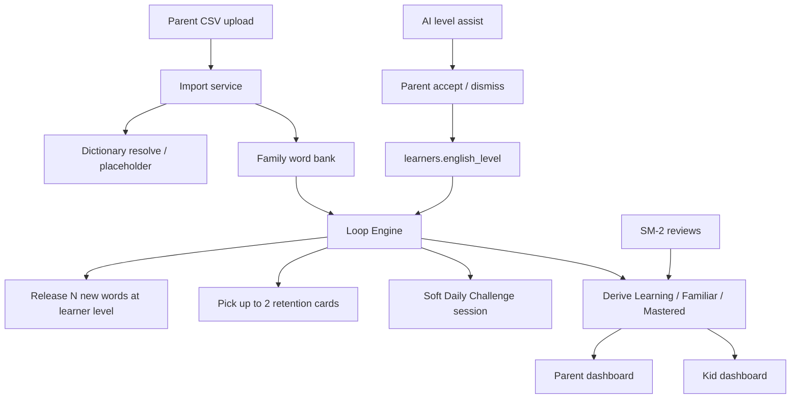
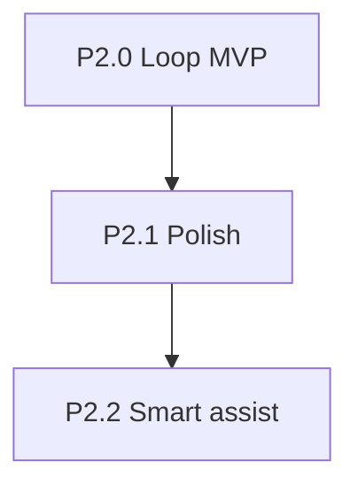

# myvocabulary — Phase 2 Technical Specification

**Version:** 1.1  
**Date:** 2026-08-04  
**Status:** P2.0 Loop MVP + recognition-first pedagogy shipped on `main` · P2.1 polish in progress  
**Repository:** `hkdad/myvocabulary`  
**Depends on:** Phase 1 complete (`docs/phase-1-spec.md`, shipped on `main`)

---

## 1. Executive Summary

### 1.1 Goals

Phase 2 turns the app from “assign curated lists and review” into a **family word bank + daily learning loop**:

1. Parent uploads a large shared vocabulary bank (CSV, 3000+ words)
2. Words carry **CEFR level** + **category**; kids practice from the same bank at their own level
3. New learners start at **A1 / PRE-A1** — school grade is not used as vocab capability
4. A **Loop Engine** drips new words and mixes rare retention so kids don’t forget
5. Soft **Daily Challenge** on the learner home (suggestion, not a hard gate)
6. Parent and kid **dashboards** show Learning / Familiar / Mastered / Due
7. AI assists level assessment and blank/disputed word levels (parent always approves)

### 1.2 Locked product decisions

| Decision | Value |
|----------|-------|
| Content model | One **family word bank** (shared content, separate SRS per learner) |
| Learner start level | **A1** for both kids until AI + parent promote |
| Ages / school level | Not confirmed; do not use school grade as CEFR |
| Import | Parent **CSV file upload** |
| CSV columns | `word,definition,level,category` |
| Categories (v1) | Fixed set of 8 (expand later) |
| Word levels in CSV | Present; AI may assist blanks/disputes |
| Daily mix | Kid **5 new + 2 retention**; teen **8 + 2** (tunable) |
| Daily Challenge | Soft suggestion on home |
| Already known | Rare retention via SRS strength — **no second “learned” table** |
| Dictionary miss | Placeholder definition |
| Goals | Adjustable later; ship defaults first |

### 1.3 Family profiles (seed defaults)

| Profile | Username / password | Working level (seed) | UI mode | Notes |
|---------|---------------------|----------------------|---------|-------|
| Parent | `parent` / `parent123` | — | — | Uploads bank, monitors all |
| Teen demo | `mia` / `mia` | **B1** | `teen` | Demo level above start; parent-editable |
| Kid demo | `leo` / `leo` | **A2** | `kid` | Demo level above start; parent-editable |
| Younger demo | `max` / `max` | **PRE-A1** | `kid` | Third learner for local / CI testing |

Product rule for new learners: start at **A1** (or PRE-A1 when the bank uses that band) until AI + parent promote. Seed levels above may differ for demo data. UI mode remains parent-editable.

### 1.4 Success criteria

| Criterion | Target |
|-----------|--------|
| Parent uploads CSV into family bank | File upload UI + API |
| Bank stores level + category per word | Validated columns |
| Dictionary miss gets placeholder | Import continues |
| Learners start A1; practice filtered by level | Loop Engine |
| New words drip (not all due at once) | Cap = daily new goal |
| Daily mix 5+2 / 8+2 available as soft challenge | Home CTA |
| Strength visible: Learning / Familiar / Mastered | Dashboard |
| Separate progress per child on same bank | Existing SRS isolation |
| Loop covered by automated tests | Unit + API + **E2E** |

### 1.5 Scope

| In scope (Phase 2) | Out of scope |
|--------------------|--------------|
| Family word bank + CSV upload | Full bilingual UI / Chinese-first FTS |
| Per-item level + category | Anki / `.apkg` import |
| Loop Engine (drip + daily mix + strength) | New SRS algorithm |
| Soft Daily Challenge (recognition-first) | Gamification empire (coins, shops) |
| Parent + kid progress + **readiness gauge** | Category CMS / free-form ontology |
| Lazy 繁中 on MCQ options (post-English) | Speech-to-text |
| AI level assessment + readiness-gated Level-up exam | PWA / offline-first |
| E2E for the learning loop | PostgreSQL |

### 1.6 Pedagogy: recognition-first (CERT-style)

Hong Kong **CERT** vocabulary assessment is **recognition-first**: learners show they know a word by
matching it to meaning, usage, and context — not by spelling every item from memory. Spelling
matters for school dictation, but it is not the gate for daily progress or level strength.

| Layer | What counts | What is optional |
|-------|-------------|------------------|
| **Daily challenge** | Listen & Pick on the mix **then** SRS recognition review (≥80% correct) | Typed dictation |
| **Strength** | Distinct days of successful recognition reviews (`quality ≥ 3`) | Dictation scores |
| **Level-up / streak challenges** | Multiple-choice word recognition | — |
| **Mistake book** | Same two steps as daily challenge: recognition **then** Listen & Pick (up to 5 words) | Typed dictation |
| **School lists** | Review flashcards first; Listen & Pick for recognition | Typed dictation as bonus |
| **Readiness / Level-up unlock** | Multi-dimensional readiness ≥ **75%** | Parent Accept still owns level change |

**Implementation rules (shipped on `main`):**

1. `daily_challenge.completed_at` is set when **both** `srs_completed_at` and `dictation_completed_at` are set.
2. Soft Daily Challenge sets `srs_completed_at` only when every mix card was reviewed today **and** ≥80% of mix cards have a **latest** correct review (`quality ≥ 3`) today. Earlier correct + later wrong on the same card does not pass. Below that, the day stays incomplete; the kid keeps practicing the same mix.
3. `dictation_completed_at` is set when the learner finishes **Listen & Pick** (`mode=choice`, `source=daily_challenge`) on today's mix.
4. Typed dictation remains optional bonus practice.
5. Today's challenge deck is **frozen** once either Listen & Pick or recognition review completes so the mix stays stable for the rest of the day.
6. MCQ options lazy-fill Traditional Chinese (`useLazyDefinitionChoices`) after English renders.
7. Kid `ui_mode` defaults to Listen & Pick in the challenge flow; teen may use typed dictation elsewhere for school homework.
8. **Level-up exam** unlocks at readiness ≥ 75% (same threshold as parent “Ready for level-up!”), or when a parent-accepted assessment created the pending exam. Pass awards a badge; parent Accept still changes `english_level`.
9. Level-up exam size: **30** MCQ items, pass ≥ **80%** (24/30).

---

## 2. Architecture

### 2.1 High-level flow



### 2.2 Reuse from Phase 1 (do not rebuild)

| Existing | Path / notes |
|----------|--------------|
| SM-2 engine | `backend/app/core/sm2.py` |
| SRS cards + review API | `models/srs.py`, `services/srs_service.py`, `api/v1/reviews.py` |
| Word lists + assignments | `models/word_list.py`, `services/word_list_service.py` |
| Dictionary + TTS | `dictionary_service.py`, `tts_service.py` |
| AI level assessment | `ai_level_service.py`, `api/v1/level_assessment.py` |
| Challenges (event-based) | `challenge_service.py` — keep; Daily Challenge is additive |
| Parent / learner dashboards | Extend; do not replace |

### 2.3 Critical Phase 1 bug Phase 2 must fix

`initialize_from_word_list` currently creates cards with **all due immediately**. A 3000-word bank would flood both kids. Phase 2 **must** introduce new-word drip before any large import goes to production learners.

---

## 3. Family word bank

### 3.1 Concept

- One shared bank per parent family (source=`bank` or a dedicated `is_family_bank` flag on a `WordList`)
- Shared **content**; per-learner **SRS progress** stays isolated
- Practice pool for a learner = bank items where `item.level <= learner.english_level` (CEFR order A1 < A2 < B1 < B2), optionally filtered by category
- Existing curated/custom lists remain; bank is the primary Phase 2 content path

### 3.2 CSV format

```csv
word,definition,level,category
apple,A round fruit that grows on trees,A1,Food
photosynthesis,How plants make food from sunlight,B1,Science
ambiguous,,B2,General
```

| Column | Required | Rules |
|--------|----------|-------|
| `word` | Yes | Trimmed; case-normalized for dictionary lookup |
| `definition` | No | If empty → dictionary lookup → else placeholder |
| `level` | Yes* | `A1`\|`A2`\|`B1`\|`B2`. Blank → import warning row; AI assist later |
| `category` | No | Must be one of the v1 set or blank → `General` |

\*Implementation may accept blank level into a “needs level” queue rather than failing the whole file.

### 3.3 Categories (v1 fixed set)

1. Daily life  
2. School  
3. Food  
4. Animals / nature  
5. Science  
6. Feelings / people  
7. Places / travel  
8. General  

Parent cannot invent new categories in P2.0. Adding categories is a later config change.

### 3.4 Import behavior

1. Parent uploads `.csv` from parent UI
2. Server parses (UTF-8, header required), validates rows
3. For each word:
   - Resolve/create `dictionary_entries` (API → cache → placeholder)
   - Upsert bank item with `level`, `category`, `sort_order`
4. Return summary: `created`, `updated`, `skipped`, `placeholder_count`, `needs_level_count`, row errors
5. Idempotent on `(bank_id, dictionary_entry_id)` — re-upload updates level/category/definition notes

### 3.5 Placeholder definition

When lookup fails: store a clear placeholder, e.g. `"Definition pending — added from family word bank."`  
Word remains learnable (TTS on the word itself still works).

---

## 4. Loop Engine

The Loop Engine is the Phase 2 core. It sits above SM-2 and decides **what enters the day** and **how strength is shown**.

### 4.1 Responsibilities

| Responsibility | Behavior |
|----------------|----------|
| Level filter | New + mastered: current CEFR. Learning/familiar retention: any released level |
| New-word drip | Release at most `daily_new_word_goal` new cards/day |
| Retention mix | Include up to 2 rare-retention / weak cards in the daily soft session |
| Strength | Derive Learning / Familiar / Mastered from SRS fields |
| Due safety | Never mark thousands of bank words due on assign/import |
| Soft Daily Challenge | Build one suggested session/day; do not block other tiles |

### 4.2 Learner goals (new fields)

Extend `learners`:

| Field | Default (kid) | Default (teen) | Meaning |
|-------|---------------|----------------|---------|
| `daily_new_word_goal` | 5 | 8 | Max new words released per day |
| `daily_review_goal` | 7 | 10 | Sum of new + both retention goals (display) |
| `daily_learning_retention_mix` | 1 | 1 | Learning/familiar retention cards in soft daily session |
| `daily_mastered_retention_mix` | 1 | 1 | Mastered retention cards in soft daily session |

Goals are parent-editable in P2.1; P2.0 may seed defaults only.

### 4.3 Card lifecycle with drip

```text
Bank word (not yet a card)
    → eligible at learner level
    → released as SrsCard state=new, due_at=now  (counts against daily_new_word_goal)
    → learning → review
    → Familiar / Mastered (derived)
    → rare retention when due again
```

**Unreleased bank words:** no `SrsCard`, or card with `state=new` and `due_at` far future / `released_at IS NULL`. Prefer explicit `released_at` nullable column on `srs_cards` (cleaner than magic dates).

**Assign/import must not** call the old “all due now” path for the full bank.

### 4.4 Strength (derived — not a parallel table)

Strength is based on **distinct UTC calendar days** with at least one **correct** recognition review (`quality ≥ 3`). Wrong-only days do not count. A day with both wrong and correct still counts once.

| Strength | Rule | Review intent |
|----------|------|---------------|
| **(not in bucket)** | Released but **0 successful review days** | Counts as **new** in daily drip |
| **Learning** | **1** distinct successful review day | Normal SM-2 |
| **Familiar** | **2** distinct successful review days | Longer intervals |
| **Mastered** | **3+** distinct successful review days | Rare retention only |

SM-2 (`due_at`, intervals) still controls **when** a card is eligible; strength drives **bucketing** and **which retention pool** it belongs to.

### 4.5 Daily mix algorithm (soft challenge)

Input: learner, `now`, goals, family bank.

1. **Learning/familiar retention picks (up to `daily_learning_retention_mix`, default 1)**
   - Due cards with strength Learning or Familiar (any released CEFR, including higher)
   - Else filler from released cards in that strength band
2. **Mastered retention picks (up to `daily_mastered_retention_mix`, default 1)**
   - Due cards with strength Mastered **at the learner’s current CEFR only**
   - Exclude IDs already picked in step 1
   - Do not fall back to other-level mastered; empty pool uses new-drip stand-ins
3. **New picks (up to `daily_new_word_goal`)**
   - Count already released today
   - Release remaining quota from bank items at learner level not yet released
   - Exclude retention IDs
4. **Session payload**
   - Shuffled mix of retention + new
   - Metadata: `new_count`, `learning_retention_count`, `mastered_retention_count`, `retention_count` (sum), `suggested`, `completed_today`
4. **Kid UX:** MCQ / listen-pick friendly items  
   **Teen UX:** may open into standard review ratings

Daily Challenge completion is a soft badge/streak nudge. **Two required steps:** (1) **Listen & Pick** on the mix, then (2) recognition review at ≥ **80%** correct (latest quality per card). Below the accuracy threshold the day stays incomplete — the kid keeps practicing the same mix (retries do not wipe logs). Typed dictation is optional bonus practice. The deck is frozen once either step completes so both phases use the same mix. Mistake practice (`/app/challenge?mistakes=1`) uses recognition **then** Listen & Pick on up to five mistake words. Normal Review and Dictation remain available anytime.

### 4.6 Suggested session sizes

| | Kid (`ui_mode=kid`) | Teen (`ui_mode=teen`) |
|--|---------------------|------------------------|
| New / day | 5 | 8 |
| Learning/familiar retention | 1 | 1 |
| Mastered retention | 1 | 1 |
| Soft challenge length | ~7 items shown | ~10 |
| School-night time | ~10–12 min | ~15–20 min |
| New / week (5 nights) | ~25 | ~40 |

Product copy should show: *“5 new + 1 learning/familiar + 1 mastered ≈ 7 cards”* and warn on parent dashboard if due queue > 2× `daily_review_goal`.

### 4.7 Loop Engine API (proposed)

| Method | Path | Role | Purpose |
|--------|------|------|---------|
| `POST` | `/api/v1/word-bank/import` | parent | CSV upload |
| `GET` | `/api/v1/word-bank` | parent | Bank summary + filters |
| `GET` | `/api/v1/loop/today` | learner | Soft daily mix payload |
| `POST` | `/api/v1/loop/today/complete` | learner | Mark soft challenge done |
| `GET` | `/api/v1/loop/progress` | learner + parent | Strength counts |
| `POST` | `/api/v1/reviews/release-new` | system/learner | Explicit drip (or internal to `/loop/today`) |

Exact paths may nest under existing routers; names above are the contract for tests.

### 4.8 Service module

New: `backend/app/services/loop_engine.py` (pure-ish functions + DB orchestration)

- `release_new_words(learner, limit, now)`
- `pick_retention(learner, limit, now)`
- `build_daily_mix(learner, now)`
- `derive_strength(distinct_review_days) -> learning|familiar|mastered`
- `progress_summary(learner_id)`

Unit-test these without HTTP.

---

## 5. Dashboards

### 5.1 Kid dashboard / home

- Soft Daily Challenge card (CTA, not modal lock) — **Listen & Pick then recognition review (≥80%)**
- Progress bar advances after Listen & Pick; completes after recognition review
- Counts: Due today · New left today · Learning · Familiar · Mastered
- Streak if challenge completed (both phases)
- Tiles: Listen & Pick before typed Dictation; Review and Lists always available

### 5.2 Parent dashboard

Per child:
- Working level (PRE-A1 / A1…)
- Strength breakdown
- Due load + warning if overloaded
- New released today / daily new goal
- Soft challenge completed today? (recognition review)
- Bank coverage: words available at this level vs total bank
- **Readiness assessment** gauge (multi-dimensional; see §5.3)

### 5.3 Readiness assessment (level progression signal)

Parent-only analytics that answer: “Is this child ready for the next CEFR level?”  
Implementation: `readiness_service.py` + `performance_analytics.py`, UI `LevelSuggestionCard` on the parent dashboard (**Level readiness** section).

**Overall score** = weighted sum of five dimensions (each 0.0–1.0).  
Practice-quality dimensions are scoped to the learner’s **current CEFR level** only:

| Dimension | Weight | Definition (shipped) |
|-----------|--------|----------------------|
| Accuracy | 30% | 80% recognition on **current-level released** cards + 20% global Listen & Pick / spelling (bonus); low sample count reduces confidence |
| Vocabulary breadth | 25% | Familiar+ (≥ 2 distinct **successful** review days) among **released** words at current level — not the full bank |
| Retention | 15% | Inverse of SRS forgetting / relearning on **current-level released** cards in the last **30 days** |
| Consistency | 15% | Stability of daily recognition accuracy on **current-level** reviews (defaults ~50% with sparse data) |
| Category balance | 15% | Weakest category % at **Mastered** (≥ 3 successful days) among **released** words at current level |

**Recommendations:**

| Overall | Label | Meaning |
|---------|-------|---------|
| ≥ 75% | Ready for level-up! | Same bar that unlocks the learner **Level-up exam** and parent auto-nudge |
| 60–74% | Progressing well | Keep practicing toward ready |
| &lt; 60% | Keep practicing | Focus areas listed on the gauge |

**Breadth copy must stay honest:** show `N familiar, M mastered of R released at {level}` (optionally note bank size separately).  
Do not score breadth or category balance against the entire unreleased bank — that would block Level-up forever on large CSVs.

**Level suggestions (parent Run check):**

1. Promote only when readiness ≥ **75%**, ≥ **10** current-level review samples, and a next CEFR level exists.
2. Demote only when readiness &lt; **45%**, ≥ **10** samples, and a previous level exists (parent must Accept).
3. No promote-on-streak or promote-on-dictation shortcuts. Dictation stays a bonus inside accuracy only.
4. Target level is always **±1 CEFR step**. AI may rewrite reason/focus text; it does not invent skip levels.
5. Auto “Ready for a check?” nudge uses readiness ≥ **75%** plus a **7-day** streak (same ready bar as the exam).

**Level-up soft gate (option A):**

1. Readiness ≥ 75% → learner may start Level-up exam (badge on pass).
2. Parent runs level check → Accept → `english_level` updates + pending exam unlocked even if readiness later dips.
3. Stale self-started `in_progress` exams without an accepted assessment do **not** bypass the gate.

Parents control **level** and practice goals; they do not configure readiness weights in v1.

---

## 6. AI assist (Phase 2 use)

| Use | Behavior |
|-----|----------|
| Learner level | Rules decide adjacent promote/demote from readiness; AI optional narrative; parent accepts |
| Blank / disputed word levels | Optional batch suggest; parent edits before apply (P2.2+) |
| Daily +2 picks | **Rules first** in P2.0; AI ranking is P2.2+ |

No AI required for offline/dev — rule-based drip, strength, and readiness always work.

---

## 7. Data model changes

### 7.1 `word_list_items` (or bank items)

| Column | Type | Notes |
|--------|------|-------|
| `level` | `TEXT` nullable | A1–B2 per word |
| `category` | `TEXT` not null default `General` | v1 enum set |

### 7.2 `learners`

| Column | Type | Notes |
|--------|------|-------|
| `daily_new_word_goal` | `INT` | default 5 |
| `daily_learning_retention_mix` | `INT` | default 1 |
| `daily_mastered_retention_mix` | `INT` | default 1 |

New learners default to `english_level='A1'` (or PRE-A1 when used). Seed demos: Mia B1 teen, Leo A2 kid, Max PRE-A1 kid.

### 7.3 `srs_cards`

| Column | Type | Notes |
|--------|------|-------|
| `released_at` | `DateTime` nullable | Null = not yet in drip pool as due-new |

### 7.4 Soft daily challenge log

New table `daily_challenge_logs` (name flexible):

| Column | Notes |
|--------|-------|
| `learner_id` | FK |
| `challenge_date` | local/UTC date key |
| `new_count` / `retention_count` | Snapshot |
| `completed_at` | nullable |
| Unique `(learner_id, challenge_date)` | One soft challenge record/day |

---

## 8. Implementation sprints



### P2.0 — Loop MVP ✅ shipped on `main`

| # | Task | Output | Status |
|---|------|--------|--------|
| 2.0.1 | Migrations: item level/category, learner goals, `released_at`, daily log | Alembic | ✅ |
| 2.0.2 | CSV import API + parent upload UI | Family bank | ✅ |
| 2.0.3 | Placeholder dictionary path | Import resilience | ✅ |
| 2.0.4 | Loop Engine service + drip fix (no due flood) | `loop_engine.py` | ✅ |
| 2.0.5 | `GET /loop/today` + soft home CTA | Daily mix | ✅ |
| 2.0.6 | Strength on parent + kid dashboards | Progress UI | ✅ |
| 2.0.7 | Seed family + Leo/Max `kid` | Correct defaults | ✅ |
| 2.0.8 | Unit + API tests for loop | pytest | ✅ |
| 2.0.9 | **E2E: learning loop** | Playwright | ✅ |
| 2.0.10 | Recognition-first daily complete + lazy 繁中 | Pedagogy | ✅ |
| 2.0.11 | Readiness gauge + Level-up unlock at 75% | Parent + Challenges | ✅ |

### P2.1 — Polish (in progress)

| # | Task |
|---|------|
| 2.1.1 | Category filter in practice / bank browse |
| 2.1.2 | Parent goal editing UI |
| 2.1.3 | Due-load warning when queue > 2× review goal |
| 2.1.4 | Mark “already know” bulk on import preview |
| 2.1.5 | Master+ challenge (spelling gate for Mastered words) — see deferred backlog |

### P2.2 — Smart assist

| # | Task |
|---|------|
| 2.2.1 | AI assist for blank word levels |
| 2.2.2 | Smarter retention picks |
| 2.2.3 | Weekly packs / auto-split views |

---

## 9. Testing strategy

### 9.1 Unit (required)

| Area | Cases |
|------|-------|
| `derive_strength` | Distinct-day boundaries 1 / 2 / 3 |
| `release_new_words` | Caps at goal; level filter; idempotent same day |
| `pick_retention` | Splits learning/familiar vs mastered pools; mastered current-CEFR only |
| `build_daily_mix` | Kid 5+1+1, teen 8+1+1; empty bank; all mastered |
| CSV parse | Happy path, missing columns, placeholder rows, bad level |

### 9.2 API (required)

- Parent upload CSV → bank counts increase
- Learner A1 does not receive B2 as new releases
- Second call to release same day does not exceed goal
- Progress endpoint returns strength buckets
- Soft challenge complete once per day

### 9.3 E2E — learning loop (required for P2.0)

New Playwright file: `e2e/learning-loop.spec.ts` (name flexible).

**Fixture:** small CSV (e.g. 12 A1 + 5 B1 words) uploaded in test setup via parent UI or API helper.

| # | Scenario | Steps | Expect |
|---|----------|-------|--------|
| E1 | Parent imports bank | Login parent → upload CSV → see summary | Created count &gt; 0; categories visible |
| E2 | Kid soft daily mix | Login leo → home shows Daily Challenge | Suggests ≤ 5 new + ≤ 2 retention |
| E3 | No due flood | After import, leo due/new released | Not equal to full bank size |
| E4 | Complete soft challenge | Start CTA → finish session → home | Completed / streak affordance |
| E5 | Progress visible (kid) | Open progress/home stats | Learning/Familiar/Mastered counts render |
| E6 | Progress visible (parent) | Parent dashboard for Leo | Same buckets + level A1 |
| E7 | Level isolation | Mia/Leo both A1; bank has B1 words | New + mastered are A1; unreleased B1 stays out |
| E8 | Teen quota | Mia daily mix | New cap 8 (or teen default) |

E2E must run in CI with existing `make test-e2e` / Playwright job. Prefer API helpers for seed/import speed; UI assertions for parent upload + learner home.

### 9.4 Regression

Keep existing `e2e/parent-flows.spec.ts`, `learner-flows.spec.ts`, `smoke.spec.ts` green. Fixing drip must not break initialize-from-list for small custom homework lists (small lists may still release all if under daily cap).

---

## 10. Non-goals and pushbacks (explicit)

1. **No second “learned words” database** — strength is derived from SRS.
2. **No dumping 3000 cards due today** — bank ≠ due pile.
3. **No category CMS** — fixed 8 tags first.
4. **No AI-required daily pedagogy** — rules pick the +2.
5. **School grade ≠ CEFR** — both start A1; AI + parent promote.
6. **Daily Challenge is not a hard gate** — soft suggestion only.
7. **Level-up exam is readiness-gated** (≥ 75%) — not always-on practice.
8. Deferred backlog (full bilingual UI, Anki, PWA, Master+, etc.) stays deferred unless re-prioritized.

---

## 11. Rollout notes

1. P2.0 Loop Engine + recognition-first + readiness gate are on `main` — deploy via `./start.sh`
2. Parent uploads real 3000+ CSV after E2E green on fixture CSV
3. Watch due counts for first week; tune goals if overloaded
4. Use readiness ≥ 75% + parent Accept before promoting levels on a live family DB

---

## 12. Doc index

| Doc | Role |
|-----|------|
| [phase-1-spec.md](./phase-1-spec.md) | Phase 1 technical truth (shipped; challenge sizes superseded by §1.6) |
| [phase-2-spec.md](./phase-2-spec.md) | This document — current product truth for loop + readiness |
| [project-plan.md](./project-plan.md) | Sprint roadmap including Phase 2 |
| [project-status.md](./project-status.md) | Current milestone status |
| [deploy-docker-home.md](./deploy-docker-home.md) | Home Docker deploy + test logins |

---

*P2.0 shipped on `main`. Continue polish in P2.1; keep this spec aligned when product rules change.*
