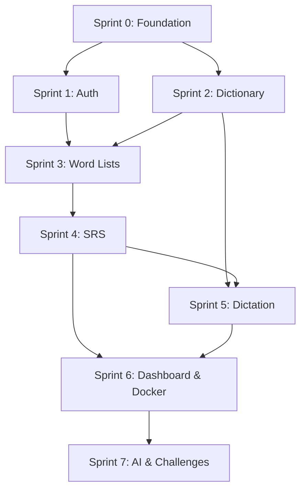
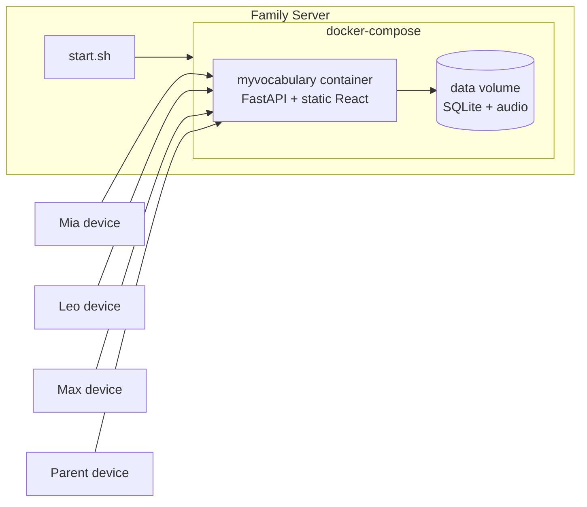
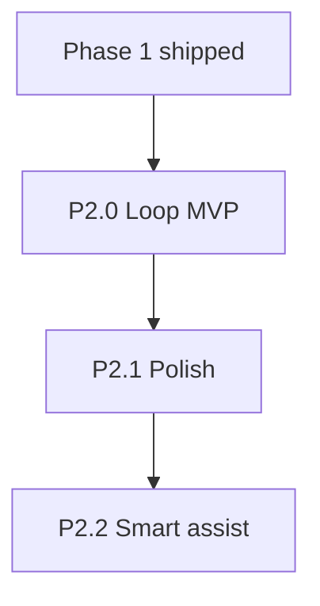

# myvocabulary — Project Plan

**Version:** 1.3  
**Date:** 2026-08-04  
**Status:** Phase 1 shipped · Phase 2 P2.0 shipped on `main` · P2.1 polish in progress  
**Repository:** `hkdad/myvocabulary`

---

## 1. Project Overview

### 1.1 Vision

A family vocabulary learning and dictionary web app for two children, managed by a parent. Each child uses their own device with their own account. The parent manages a **shared family word bank** and monitors progress from a separate dashboard.

Phase 1 shipped curated lists, SM-2 reviews, dictation, AI level assessment, and challenges. Phase 2 adds CSV bank import, a **Loop Engine** (new-word drip + retention mix), soft daily challenges, and strength dashboards so kids learn without forgetting — without flooding them with thousands of due cards.

**Pedagogy (Phase 2+):** Daily progress follows **CERT-style recognition-first** learning — match words to meanings to complete the day; spelling and Listen & Pick are bonus practice. See [phase-2-spec.md](./phase-2-spec.md) §1.6.

### 1.2 Family Profiles

| Profile | Username / password | Age (seed) | Working level (seed) | UI Mode | Device |
|---------|---------------------|------------|----------------------|---------|--------|
| Parent | `parent` / `parent123` | — | — | — | Phone/laptop |
| Teen demo | `mia` / `mia` | 13 | **B1** (demo) | `teen` | Own device |
| Kid demo | `leo` / `leo` | 9 | **A2** (demo) | `kid` | Own device |
| Younger demo | `max` / `max` | 5 | **PRE-A1** (demo) | `kid` | Own device |

**Phase 2 note:** School grade is **not** used as vocabulary capability. New learners start at **A1** (or PRE-A1); AI + readiness suggest promotions; parent accepts. Seed levels may be higher for demo. Ages/UI remain adjustable.

### 1.3 Tech Stack

| Layer | Technology |
|-------|------------|
| Frontend | React 18, TypeScript, Vite, Tailwind CSS, shadcn/ui, TanStack Query, Zustand |
| Backend | Python 3.12+, FastAPI, SQLAlchemy 2.0, Alembic, Pydantic v2 |
| Database | SQLite (WAL + FTS5) |
| Audio | edge-tts, pydub, ffmpeg |
| Tooling | uv (Python), pnpm (Node), Ruff, ESLint, Prettier, pytest, Vitest |
| CI | GitHub Actions |
| Deployment | Docker + docker-compose, `start.sh` startup script |
| AI (level assist) | OpenAI-compatible API (optional key in `.env`) |

### 1.4 Design Principles

1. **Shared content, separate progress** — dictionary words and audio are shared; SRS cards, dictation history, and mistakes are per child.
2. **Age-appropriate UX** — same app, different themes and interaction patterns for `kid` vs `teen`.
3. **Parent-managed, kid-independent** — children use the app daily without parent help; parent handles setup and monitoring.
4. **SQLite-first** — simple backup (copy one file), no database server required.
5. **Foundation before features** — complete P0 engineering checklist before writing feature code.
6. **Docker-first deployment** — production runs via Docker; `start.sh` is the single entry point to bring the app up.
7. **Shared bank + adaptive levels** — one family word bank; each child starts at A1 and progresses with parent control and AI-assisted assessment. Never dump the full bank into the due queue.

### 1.5 Content & Engagement Strategy

#### Family word bank (Phase 2 primary) + curated lists (Phase 1)

**Phase 2:** Parent uploads one shared CSV bank (3000+ words) with per-word `level` + `category`. Both kids practice from the same bank; the Loop Engine filters by each learner’s working CEFR and drips new words daily.

**Phase 1 (still available):** Pre-built curated lists and custom homework lists.

| Source type | Examples | Level tagging |
|-------------|----------|---------------|
| Family bank CSV | Parent-owned 3000+ list | Per-word A1–B2 + category |
| CEFR word lists | Oxford 3000, EVP subsets | A1–B2 (catalog) |
| Custom lists | School homework, spelling tests | List-level `level_tag` |

**Phase 2 workflow:**
1. Parent uploads CSV (`word,definition,level,category`) into the family bank
2. Dictionary resolve → placeholder if missing
3. Both learners start **A1**; Loop Engine releases `5+2` (kid) or `8+2` (teen) daily
4. Strength dashboards show Learning / Familiar / Mastered
5. AI may suggest learner level-ups and blank word levels; parent accepts

Curated catalog import (`scripts/import_curated_lists.py`) remains for bootstrap content.

#### AI-assisted level assessment

An optional AI service reviews each child's performance (accuracy, mistake patterns, words mastered) and suggests level adjustments. The parent always approves changes.

| Input | AI output | Parent action |
|-------|-----------|---------------|
| Review accuracy, dictation scores, mistake log | Suggested CEFR level (e.g. A2 → B1) | Accept or dismiss |
| Words consistently missed | Recommended focus list | Assign suggested list |
| Strong performance over 2+ weeks | "Ready for level-up challenge?" | Trigger challenge |

**Implementation:** Backend service calls an OpenAI-compatible API with structured prompts. Requires `OPENAI_API_KEY` (or compatible endpoint) in `.env`. Works without AI key — app falls back to rule-based suggestions (accuracy thresholds).

#### Level-up challenges

Short challenge sessions make progression feel rewarding and test readiness before moving up a level.

| Challenge type | Description | Unlock |
|----------------|-------------|--------|
| **Level-up exam** | **30** MCQ recognition items; pass ≥ **80%** (24/30) for badge | Readiness ≥ **75%**, or parent-accepted assessment |
| **Streak challenge** | Review 7 days in a row | Automatic (7-day streak) |
| **Mistake mastery** | Clear words via daily challenge (`?mistakes=1`) | Mistake book has entries |
| **Speed dictation** | Typed timed dictation (teen) | Deferred — hidden until timed UX exists |

**Rewards:** Badge on profile; parent Accept (not exam alone) changes `english_level` and may assign next-level lists. Progress stored in `level_challenges` table. See [phase-2-spec.md](./phase-2-spec.md) §5.3.

---

## 2. Implementation Sprints

### Sprint Dependency Graph



---

### Sprint 0: Foundation

**Goal:** Monorepo scaffold, tooling, and database migration — no feature code.

| # | Task | Output |
|---|------|--------|
| 0.1 | Init monorepo structure | `backend/`, `frontend/`, `docs/`, `scripts/`, `data/` |
| 0.2 | Backend: `pyproject.toml`, FastAPI app factory, config, async DB session | `backend/app/main.py`, `config.py`, `database.py` |
| 0.3 | Alembic init + migration 001 (all tables + FTS5) | `alembic/versions/001_initial_schema.py` |
| 0.4 | Frontend: Vite + React + Tailwind + shadcn/ui scaffold | `frontend/` with dev server running |
| 0.5 | `Makefile`, `.env.example`, `README.md` | `make install`, `make dev`, `make test` |
| 0.6 | Pre-commit hooks (Ruff, ESLint, Prettier) | `.pre-commit-config.yaml` |
| 0.7 | GitHub Actions CI (lint + typecheck + test) | `.github/workflows/ci.yml` |
| 0.8 | Update `.gitignore` for Node, SQLite data dir, OS files | |
| 0.9 | SQLite backup script | `scripts/backup-db.sh` |
| 0.10 | Auth design doc | `docs/adr/001-auth-cookies.md` |
| 0.11 | Docker scaffold: `Dockerfile`, `docker-compose.yml`, `.dockerignore` | Dev/prod compose files |
| 0.12 | `start.sh` skeleton (calls docker-compose) | Executable at repo root |

**Exit criteria:**
- [ ] `make install && make dev` starts backend + frontend
- [ ] `make test` passes (even if minimal)
- [ ] `alembic upgrade head` creates all tables
- [ ] CI green on push
- [ ] `docker compose config` validates without errors

---

### Sprint 1: Auth & Profiles

**Goal:** Parent and learner accounts, login, role-based routing.

| # | Task | Output |
|---|------|--------|
| 1.1 | User/Learner models + seed script | `models/user.py`, `models/learner.py`, `scripts/seed.py` |
| 1.2 | Auth service (JWT + httpOnly refresh cookies) | `services/auth_service.py`, `core/security.py` |
| 1.3 | Auth API endpoints | `api/v1/auth.py`, `api/v1/learners.py` |
| 1.4 | Frontend auth store + API client + interceptors | `stores/authStore.ts`, `api/client.ts` |
| 1.5 | LoginPage + ProtectedRoute + RoleRoute | `pages/LoginPage.tsx`, `routes/` |
| 1.6 | Parent LearnersPage (CRUD) | `pages/parent/LearnersPage.tsx` |
| 1.7 | Auth integration tests | `tests/integration/test_auth.py` |

**Exit criteria:**
- [ ] Parent can log in → `/parent/dashboard`
- [ ] Mia logs in → `/app/home` (teen theme)
- [ ] Leo logs in → `/app/home` (kid theme)
- [ ] Learner cannot access parent routes (403)
- [ ] Session persists after browser restart
- [ ] Seed creates parent + mia + leo accounts

---

### Sprint 2: Dictionary & TTS

**Goal:** English word lookup, FTS5 search, audio playback.

| # | Task | Output |
|---|------|--------|
| 2.1 | Dictionary service (Free Dictionary API fetch + SQLite cache) | `services/dictionary_service.py` |
| 2.2 | FTS5 search implementation | Search endpoint with ranking |
| 2.3 | TTS service (edge-tts + filesystem cache) | `services/tts_service.py` |
| 2.4 | Dictionary API endpoints | `api/v1/dictionary.py` |
| 2.5 | Frontend DictionaryPage + WordCard + AudioPlayer | `pages/learner/DictionaryPage.tsx` |
| 2.6 | Dictionary integration tests | `tests/integration/test_dictionary.py` |

**Exit criteria:**
- [ ] Search "elephant" returns definition
- [ ] TTS plays on first lookup; cached on second
- [ ] Parent can manually add a word
- [ ] FTS5 search works across word + definition

---

### Sprint 3: Word Lists, Curated Catalog & Assignment

**Goal:** Parent assigns curated or custom lists to individual children.

| # | Task | Output |
|---|------|--------|
| 3.1 | Word list models + API (CRUD + items) | `api/v1/word_lists.py` |
| 3.2 | Assignment API | `POST /word-lists/{id}/assign` |
| 3.3 | Curated list import script (CEFR-tagged sources) | `scripts/import_curated_lists.py` |
| 3.4 | Curated catalog API (browse by level) | `GET /word-lists/catalog?level=A2` |
| 3.5 | Parent WordListsPage + CatalogBrowser + AssignmentsPage | `pages/parent/WordListsPage.tsx` |
| 3.6 | Learner assigned lists view | `pages/learner/WordListsPage.tsx` |
| 3.7 | Seed Mia with B1 catalog lists, Leo with A2 catalog lists | Updated `scripts/seed.py` |

**Exit criteria:**
- [ ] Curated catalog imported (≥ 3 lists per level: A2, B1)
- [ ] Parent browses catalog filtered by level
- [ ] Parent assigns curated list to Leo only
- [ ] Mia does not see Leo's list
- [ ] Parent can still create and assign custom lists
- [ ] Leo sees assigned list in `/app/lists`

---

### Sprint 4: SRS Flashcards

**Goal:** Spaced repetition review sessions per child.

| # | Task | Output |
|---|------|--------|
| 4.1 | SM-2 core module + unit tests | `core/sm2.py`, `tests/unit/test_sm2.py` |
| 4.2 | SRS models + review log | `models/srs.py` |
| 4.3 | SRS service (initialize, due, answer) | `services/srs_service.py` |
| 4.4 | Reviews API endpoints | `api/v1/reviews.py` |
| 4.5 | Frontend ReviewPage + FlashcardDeck + RatingButtons | `pages/learner/ReviewPage.tsx` |
| 4.6 | Kid mode: 3-button rating simplification | Hard / Good / Easy |
| 4.7 | SRS integration tests | `tests/integration/test_srs.py` |

**Exit criteria:**
- [ ] Leo initializes cards from assigned list
- [ ] Review session shows due cards
- [ ] SM-2 updates intervals correctly
- [ ] Kid sees 3 buttons; teen sees 0–5 scale
- [ ] Mia and Leo have independent card progress

---

### Sprint 5: Dictation

**Goal:** Age-appropriate dictation with mistake tracking.

| # | Task | Output |
|---|------|--------|
| 5.1 | Dictation service + scoring | `services/dictation_service.py` |
| 5.2 | Dictation API endpoints | `api/v1/dictation.py` |
| 5.3 | Mistake log integration | `models/mistake_log` usage |
| 5.4 | Frontend DictationPage (typed + choice modes) | `pages/learner/DictationPage.tsx` |
| 5.5 | Dictation unit + integration tests | `tests/unit/test_dictation_scoring.py` |

**Exit criteria:**
- [ ] Leo gets multiple-choice dictation with hints
- [ ] Mia gets typed dictation
- [ ] Wrong answers logged to mistake book
- [ ] Session score shown at end
- [ ] Mistake words appear in review queue

---

### Sprint 6: Dashboard, Docker Deployment & Polish

**Goal:** Parent overview, learner home/stats, Docker production deployment via `start.sh`.

| # | Task | Output |
|---|------|--------|
| 6.1 | Dashboard service + API | `api/v1/dashboard.py` |
| 6.2 | Parent DashboardPage | `pages/parent/DashboardPage.tsx` |
| 6.3 | Learner HomePage + StatsPage | `pages/learner/HomePage.tsx` |
| 6.4 | ui_mode theming (kid vs teen CSS) | `index.css` theme tokens |
| 6.5 | Error handling, loading states, empty states | All pages |
| 6.6 | E2E smoke test (Playwright) | Login → review 1 card |
| 6.7 | Production Docker image (multi-stage build) | `Dockerfile` |
| 6.8 | `docker-compose.yml` for production (API + volume mounts) | `data/`, `logs/` volumes |
| 6.9 | `start.sh` — one-command startup | `./start.sh` brings up full stack |
| 6.10 | Production build serves static from FastAPI in container | `app/main.py` StaticFiles mount |

**Exit criteria:**
- [ ] Parent sees both kids' progress on dashboard
- [ ] Leo's home shows "Review Today" with due count
- [ ] Mia's stats show accuracy and streak
- [ ] Kid theme vs teen theme visually distinct
- [ ] E2E test passes
- [ ] `./start.sh` starts app; accessible on configured port
- [ ] SQLite DB and audio persist across container restarts (volume mount)
- [ ] `docker compose down && ./start.sh` recovers cleanly

---

### Sprint 7: AI Level Assessment & Level-Up Challenges

**Goal:** AI-assisted level recommendations and engaging level-up challenges.

| # | Task | Output |
|---|------|--------|
| 7.1 | AI level assessment service (OpenAI-compatible) | `services/ai_level_service.py` |
| 7.2 | Rule-based fallback when no API key | Accuracy threshold suggestions |
| 7.3 | Level assessment API | `GET /learners/{id}/level-suggestion` |
| 7.4 | Parent LevelSuggestionCard (accept/dismiss) | `pages/parent/DashboardPage.tsx` |
| 7.5 | Level-up challenge models + service | `models/level_challenge.py` |
| 7.6 | Challenge API (start, submit, complete) | `api/v1/challenges.py` |
| 7.7 | Learner ChallengePage (exam + rewards) | `pages/learner/ChallengePage.tsx` |
| 7.8 | Auto-suggest challenge when performance threshold met | Dashboard + home notifications |
| 7.9 | Tests for challenge scoring + AI fallback | `tests/` |

**Exit criteria:**
- [ ] Parent sees AI level suggestion for Leo (or rule-based fallback)
- [ ] Parent accepts suggestion → Leo's `english_level` updates
- [ ] Leo completes level-up challenge; badge shown on profile
- [ ] Mia can take speed dictation challenge (teen mode)
- [ ] App works fully without `OPENAI_API_KEY` (rule-based mode)

---

## 3. Engineering Checklist

### P0 — Must complete before feature code (Sprint 0)

- [ ] Monorepo folder structure (`backend/`, `frontend/`, `docs/`, `scripts/`)
- [ ] `pyproject.toml` + `uv.lock`; `package.json` + `pnpm-lock.yaml`
- [ ] `.gitignore` updated for Node, SQLite data dir, OS files
- [ ] `.env.example`; config loading via Pydantic Settings
- [ ] FastAPI app skeleton with `/health`, `/api/v1` router mount
- [ ] SQLAlchemy + Alembic wired; initial migration (all tables)
- [ ] SQLite WAL + FK pragmas on connect
- [ ] Pre-commit hooks (Ruff, ESLint, Prettier)
- [ ] CI: lint + typecheck + test
- [ ] `Makefile` with `install`, `dev`, `test`, `lint`, `migrate`, `seed`
- [ ] `README.md` with quick start
- [ ] Auth design doc (`docs/adr/001-auth-cookies.md`)
- [ ] Backup script for SQLite (`scripts/backup-db.sh`)

### P1 — First sprint alongside features (Sprints 1–2)

- [ ] User auth (login, logout, refresh, child/parent roles)
- [ ] RBAC middleware tested on every parent endpoint
- [ ] OpenAPI → TypeScript type generation
- [ ] TanStack Query + API client scaffold
- [ ] Feature folder structure in frontend
- [ ] Integration tests for auth + dictionary
- [ ] Playwright: one happy-path E2E
- [ ] Rate limiting on login endpoints
- [ ] Dependabot configured

### P2 — Nice to have (post Phase 1)

- [ ] Full E2E suite
- [ ] PWA / offline support
- [ ] Automated cloud backup (restic)
- [ ] Parent PIN on learner logout
- [ ] Sentry error tracking

---

## 4. Milestones

| Milestone | Sprint | Deliverable | Definition of Done |
|-----------|--------|-------------|-------------------|
| **M0: Scaffold** | Sprint 0 | Dev environment running | `make dev` works, CI green |
| **M1: Login** | Sprint 1 | Auth + profiles | 3 accounts login, role routing works |
| **M2: Dictionary** | Sprint 2 | Word lookup + TTS | Search and audio playback |
| **M3: Lists** | Sprint 3 | Parent assigns words | Per-child list visibility |
| **M4: Learn** | Sprint 4 | SRS flashcards | Review session with SM-2 |
| **M5: Dictate** | Sprint 5 | Dictation modes | Kid MCQ + teen typed |
| **M6: Ship** | Sprint 6 | Docker deployment | `./start.sh` runs full app |
| **M7: Engage** | Sprint 7 | AI + challenges | Level suggestions + level-up exam |

---

## 5. Key Engineering Decisions

| Decision | Choice | Rationale | ADR |
|----------|--------|-----------|-----|
| Repo layout | Monorepo | One PR spans API + UI; single deploy | — |
| Python tooling | uv | Fast, PEP 621 native, lock file | — |
| Node tooling | pnpm | Fast installs, strict resolution | — |
| Auth storage | httpOnly cookies for refresh | Safer than localStorage on kids' devices | `docs/adr/001-auth-cookies.md` |
| SRS algorithm | SM-2 | Well-understood; kid mode simplifies ratings | — |
| Dictionary source | Free Dictionary API + cache | Free, adequate for English | — |
| TTS | edge-tts | Free, good EN voices, cache locally | — |
| DB location | `data/myvocabulary.db` | Gitignored, easy backup | — |
| Deployment | Docker + `start.sh` | One-command family server setup | `docs/adr/002-docker-deployment.md` |
| Word list content | Curated catalog + custom | CEFR-aligned imports; parent adjusts | — |
| Level assessment | AI + rule-based fallback | Parent approves all level changes | — |
| Engagement | Level-up challenges | Short exams, badges, unlock next level | — |

---

## 6. Risk Register

| Risk | Likelihood | Impact | Mitigation | Owner |
|------|------------|--------|------------|-------|
| Dictionary API downtime | Medium | Lookup fails | SQLite cache + manual entry | Backend |
| edge-tts unavailable | Low | No new audio | Pre-cache on list creation | Backend |
| SM-2 too harsh for 10yo | Medium | Poor engagement | Kid 3-button ratings | Frontend |
| Scope creep (Chinese, mobile) | High | Delayed delivery | Strict Phase 1 scope | All |
| AI API cost / availability | Medium | No level suggestions | Rule-based fallback; optional API key | Backend |
| Curated list licensing | Low | Bad source data | Use open educational lists; document sources | Content |
| Kid forgets password | Medium | Locked out | Parent reset-password endpoint | Backend |
| SQLite on cloud-sync folder | Low | DB corruption | Keep DB on local disk only | DevOps |
| No backup → lost progress | Medium | Family data loss | Daily backup script (P0) | DevOps |

---

## 7. Testing Plan

### Per-sprint testing requirements

| Sprint | Unit Tests | Integration Tests | E2E |
|--------|-----------|-------------------|-----|
| 0 | — | Health endpoint | — |
| 1 | JWT encode/decode | Auth flows, RBAC | — |
| 2 | — | Dictionary search, TTS | — |
| 3 | — | List CRUD, assignment isolation | — |
| 4 | SM-2 algorithm (100%) | Review cycle | — |
| 5 | Dictation scoring | Session flow | — |
| 6 | — | Dashboard aggregation | Login → review 1 card |
| 7 | Challenge scoring | AI fallback, challenge flow | Level-up challenge pass |

### Manual QA checklist (Sprint 6)

- [ ] Parent creates list, assigns to one child only
- [ ] Other child does not see unassigned list
- [ ] Learner stays logged in after browser restart
- [ ] TTS plays on first and subsequent visits (cached)
- [ ] Kid mode shows 4 choices in dictation
- [ ] Teen mode requires typed input
- [ ] Dashboard reflects today's activity for both kids
- [ ] Kid theme visually distinct from teen theme

---

## 8. Documentation Deliverables

| Document | Sprint | Location |
|----------|--------|----------|
| Phase 1 Technical Spec | Pre-dev | `docs/phase-1-spec.md` |
| Project Plan | Pre-dev | `docs/project-plan.md` |
| README (quick start) | Sprint 0 | `README.md` |
| Auth ADR | Sprint 0 | `docs/adr/001-auth-cookies.md` |
| Architecture overview | Sprint 0 | `docs/architecture.md` (pointers + ADRs) |
| API reference | Sprint 2 | OpenAPI at `/docs` (dev only) |
| Backup/restore guide | Sprint 0 | `docs/backup-restore.md` |

---

## 9. Deployment Plan

**Production deployment is Docker-based.** `start.sh` is the single entry point for starting the app on the family server.

### Local development (without Docker)

```bash
make install    # uv sync + pnpm install
make migrate    # alembic upgrade head
make seed       # create parent + mia + leo + max + curated lists
make dev        # backend :8000 + frontend :5173
```

### Production startup (Docker)

```bash
# First-time setup
cp .env.example .env          # edit SECRET_KEY, optional OPENAI_API_KEY
chmod +x start.sh

# Start (builds if needed, runs migrations, starts services)
./start.sh

# Stop
docker compose down
```

### `start.sh` responsibilities

1. Check Docker is installed and running
2. Create `data/` and `data/audio/` if missing
3. Copy `.env.example` → `.env` on first run (with prompt)
4. Run `docker compose up -d --build`
5. Wait for health check (`GET /health`)
6. Run `alembic upgrade head` inside container (if pending migrations)
7. Run seed/import curated lists on first run (if DB empty)
8. Print access URL and login hints

### Docker architecture



### `docker-compose.yml` (production)

| Service | Image | Ports | Volumes |
|---------|-------|-------|---------|
| `app` | Built from `Dockerfile` | `8080:8000` | `./data:/app/data` |

Optional add-on (P2): Caddy container for HTTPS reverse proxy.

### Dockerfile (multi-stage)

1. **Stage 1 (frontend):** `node:22` → `pnpm build` → `frontend/dist`
2. **Stage 2 (backend):** `python:3.12-slim` → copy `dist`, install uv deps, run uvicorn
3. Includes `ffmpeg` for audio processing

### Data persistence

| Path (host) | Path (container) | Contents |
|-------------|------------------|----------|
| `./data/myvocabulary.db` | `/app/data/myvocabulary.db` | SQLite database |
| `./data/audio/` | `/app/data/audio/` | Cached TTS files |
| `./data/backups/` | `/app/data/backups/` | Daily backup copies |

### Backup

```bash
# Manual backup
./scripts/backup-db.sh

# Recommended: cron on host (daily 2am)
0 2 * * * /path/to/myvocabulary/scripts/backup-db.sh
```

### Access

| User | URL | Device |
|------|-----|--------|
| Mia | `http://<server-ip>:8080/app` | Learner device |
| Leo | `http://<server-ip>:8080/app` | Learner device |
| Max | `http://<server-ip>:8080/app` | Learner device |
| Parent | `http://<server-ip>:8080/parent` | Parent device |

HTTPS via Caddy or nginx reverse proxy is recommended when exposing beyond the home network.

---

## 10. Phase 2 — Family bank & Loop Engine

**Spec:** [phase-2-spec.md](./phase-2-spec.md)  
**Status:** P2.0 shipped on `main` · P2.1 polish in progress

### 10.1 Goals

| Goal | Detail | Status |
|------|--------|--------|
| Family word bank | One shared CSV bank; separate SRS per child | ✅ |
| Loop Engine | New-word drip + retention mix; no due-queue flood | ✅ |
| Soft Daily Challenge | Recognition-first home suggestion; kid/teen goals | ✅ |
| Strength | Learning / Familiar / Mastered (1 / 2 / 3+ distinct days) | ✅ |
| Dashboards + readiness | Parent gauge + kid progress; Level-up at ≥75% | ✅ |
| Start level | New learners A1/PRE-A1; AI + parent promote | ✅ |
| Tests | Unit + API + **E2E learning loop** | ✅ |

### 10.2 Sprint dependency



### 10.3 P2.0 — Loop MVP ✅

Shipped: bank CSV, Loop Engine, recognition-first daily challenge, strength 1/2/3, readiness gauge, Level-up gate at 75%, lazy 繁中, MC challenges, Max seed, E2E learning-loop.

**P2.0 exit criteria (met):** Parent can upload fixture CSV; each kid sees a capped soft daily mix; dashboards show strength; E2E green; assigning/importing a large bank does **not** make all cards due.

### 10.4 P2.1 — Polish

| # | Task |
|---|------|
| 2.1.1 | Category filter (8 fixed categories) |
| 2.1.2 | Parent goal editing (`daily_new_word_goal`, review goal) |
| 2.1.3 | Due-load warning (&gt; 2× review goal) |
| 2.1.4 | Bulk “already know” on import preview |
| 2.1.5 | Configurable readiness profile (optional later) |

### 10.5 P2.2 — Smart assist

| # | Task |
|---|------|
| 2.2.1 | AI assist for blank/disputed word levels |
| 2.2.2 | Smarter retention (+2) selection |
| 2.2.3 | Weekly packs / bank views |

### 10.6 Categories (v1)

Daily life · School · Food · Animals / nature · Science · Feelings / people · Places / travel · General

### 10.7 Deferred backlog (not Phase 2)

| Feature | Priority | Notes |
|---------|----------|-------|
| Chinese / bilingual | High | Separate FTS tokenizer |
| Anki import | Medium | `.apkg` parser |
| Speech-to-text dictation | Medium | Web Speech API |
| Per-learner TTS voice | Low | Parent settings UI |
| PWA offline mode | Medium | Service worker |
| Email weekly reports | Low | SMTP |
| PostgreSQL option | Low | Only if multi-family hosting |
| **Master+ challenge** | Medium | Optional challenge tier after Mastered (3+ recognition days): mixed recognition + **spelling** for those words — productive spelling gate separate from daily recognition-first loop |

---

## 11. Next Actions

1. **P2.1 polish** — category filters, parent goal editing, due-load warnings
2. **Import real 3000+ CSV** on the family server only after due-load looks healthy for a week
3. **Master+ challenge** (deferred) — spelling gate for Mastered words
4. **Tune goals / readiness** from live practice data (defaults are starting points)

---

*See also: [phase-1-spec.md](./phase-1-spec.md) (shipped) · [phase-2-spec.md](./phase-2-spec.md) (current)*
